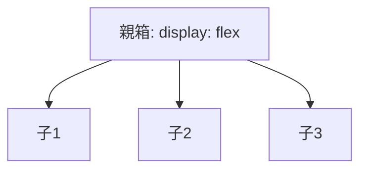

# 📖 The Visual Dictionary (翻訳辞書)

「ブロック分解」した日本語を、プログラミングの「コード」に翻訳するための辞書です。
絵（イメージ）を見て、使いたいタグを選んでください。

---

## 🏗️ 構造 (Structure)
AIに伝える時は「日本語（Block Name）」でOKです。
右側の「コード」は、AIが書いてきた時に「あ、これのことか！」と確認するために使ってください。

| イメージ | 呼び方 (Block Name) | AIが書くコード (Code) | 解読のヒント (Code Literacy) |
|:---|:---|:---|:---|
| `⬜` | **ただの箱** | `
` | 一番よく見るやつ。これが大量に重なってWebができている。 |
| `🧊` | **区画（セクション）** | `<section>` | `div`と似ているが、「ここから話題が変わるぞ」という合図。 |
| `🔘` | **ボタン** | `<button>` | `Click` とか `Submit` という文字が近くにあるはず。 |
| `🖼️` | **画像** | `` | `src="photo.jpg"` のように、画像ファイルの場所が書いてある。 |
| `🔗` | **リンク** | `<a>` | `href="https://..."` のように、飛び先のURLが書いてある。 |
| `📝` | **見出し** | `<h1>` | 文字が大きい。`h1`, `h2`... と数字が増えるほど字が小さくなる。 |

---

## 🎨 配置 & 装飾 (Layout & Style) = CSS

### 並べ方 (Flexbox)
「親箱」に命令すると、中身の子箱が整列します。

### 並べ方 (Alignment)
「どう並べたいか」を言葉で伝えましょう。

| したいこと | AIへの頼み方 | イメージ |
|:---|:---|:---|
| **横に並べる** | 「横並びにして」「Flexで並べて」 | `[1][2][3]` |
| **縦に積む** | 「縦積みにして」「縦に並べて」 | `[1]` `[2]` `[3]` |
| **真ん中に寄せる** | 「上下左右の真ん中に置いて」 | `   [1]   ` |
| **両端に飛ばす** | 「両端に配置して」 | `[1]       [2]` |

### 形と色 (Aesthetics)

| したいこと | 翻訳 (CSS Property) | イメージ |
|:---|:---|:---|
| **角を丸くする** | `border-radius: 8px;` | `[ ]` -> `( )` |
| **影をつける** | `box-shadow: 0 4px 6px gray;` | ふわっと浮く |
| **余白（内側）** | `padding: 16px;` | 箱と文字の隙間 |
| **余白（外側）** | `margin: 16px;` | 箱と箱の距離 |
| **背景色** | `background-color: #f0f0f0;` | - |
| **文字色** | `color: #333;` | - |

---

## ⚡ 動き (Logic) = JavaScript

AIに「動き」を伝えるための言葉です。

| イメージ | 呼び方 (Block Name) | AIが書くコード (Code) | 解読のヒント (Code Literacy) |
|:---|:---|:---|:---|
| `👆` | **イベント (きっかけ)** | `.addEventListener('click', ...)` | 「いつ」動くか。`click` とか `scroll` を探そう。 |
| `📦` | **データ (変数)** | `let count = 0;` | 「数字」や「文字」が入っている箱。`let` や `const` を探そう。 |
| `⚖️` | **もし〜なら (分岐)** | `if (count > 10) { ... }` | `if` という英語そのもの。条件が書いてある。 |
| `🔨` | **アクション (関数)** | `function changeColor() { ... }` | 実際の「仕事」の内容。`function` の中カッコ `{}` の中身が仕事。 |
