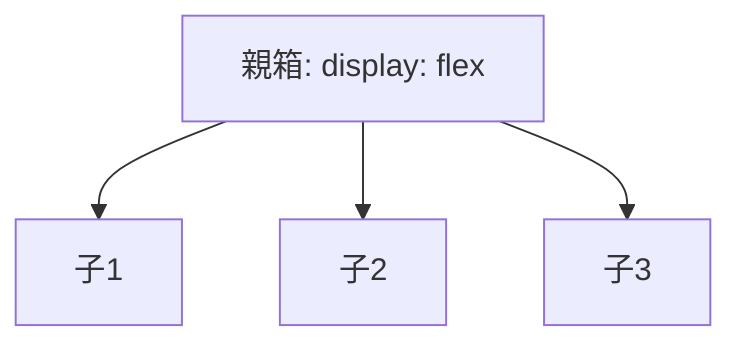

# 📖 The Visual Dictionary (翻訳辞書)

「ブロック分解」した日本語を、プログラミングの「コード」に翻訳するための辞書です。
絵（イメージ）を見て、使いたいタグを選んでください。

---

## 🏗️ 構造 (Structure) = HTML

| イメージ (Image) | 日本語 (Block Name) | 翻訳 (Tag) | 使いどころ |
|:---|:---|:---|:---|
| `⬜` | **ただの箱** | `
` | 特に意味はないけど、まとめたい時。一番よく使う。 |
| `📄` | **記事の箱** | `<article>` | ブログ記事やカードなど、中身が独立している時。 |
| `🧊` | **区画の箱** | `<section>` | 「自己紹介」「スキル」など、大きなまとまり。 |
| `🦶` | **足元** | `<footer>` | ページの一番下。コピーライトなど。 |
| `🎩` | **アタマ** | `<header>` | ページの一番上。ロゴやナビゲーション。 |
| `🔘` | **押せるボタン** | `<button>` | クリックして何かアクションする時。 |
| `🖼️` | **画像** | `` | 写真やイラストを表示したい時。 |
| `🔗` | **リンク** | `<a>` | 別のページに飛びたい時。 |
| `📝` | **見出し** | `<h1>` ~ `<h6>` | タイトル。数字が小さいほど文字が大きい。 |
| `📜` | **文章** | `
` | 普通のテキスト。 |

---

## 🎨 配置 & 装飾 (Layout & Style) = CSS

### 並べ方 (Flexbox)
「親箱」に命令すると、中身の子箱が整列します。

| したいこと | 翻訳 (CSS Property) | イメージ |
|:---|:---|:---|
| **横に並べる** | `flex-direction: row;` (デフォルト) | `[1][2][3]` |
| **縦に積む** | `flex-direction: column;` | `[1]` `[2]` `[3]` |
| **中央揃え** | `justify-content: center;` `align-items: center;` | `   [1][2][3]   ` |
| **両端に飛ばす** | `justify-content: space-between;` | `[1]       [2]` |

### 形と色 (Aesthetics)

| したいこと | 翻訳 (CSS Property) | イメージ |
|:---|:---|:---|
| **角を丸くする** | `border-radius: 8px;` | `[ ]` -> `( )` |
| **影をつける** | `box-shadow: 0 4px 6px gray;` | ふわっと浮く |
| **余白（内側）** | `padding: 16px;` | 箱と文字の隙間 |
| **余白（外側）** | `margin: 16px;` | 箱と箱の距離 |
| **背景色** | `background-color: #f0f0f0;` | - |
| **文字色** | `color: #333;` | - |

---

## 🤖 使い方 (How to use)

1.  **Block Sketch**: 紙やメモに、作りたい画面を日本語で書く。
    > 「一番上に『アタマ』があって、その中に『見出し』と『押せるボタン』を『横並び』にしたい」
2.  **Translaton**: この辞書を使って翻訳する。
    > `header` > `h1` + `button` (Flex Row)
3.  **Construct**: AIに伝える。
